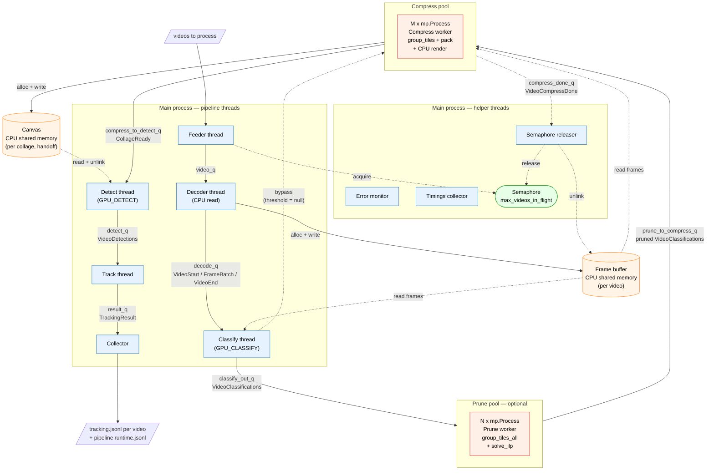

# Pipeline-Parallel Execution Runner — Design

This document describes the design of the pipeline-parallel runner that lives
under `execution/`.  It is the implementation reference; read it when you need
to extend, debug, or reason about the runner.

The runner replaces the *sequential* execution path in `scripts/run.sh` Phase 4
(p020 → p022 → p030 → p040 → p050 → p060) with an in-memory, pipeline-parallel
implementation.  All operators run concurrently; no intermediate artifacts touch
disk; the final `tracking.jsonl` lands at the same path as `scripts/p060`.

> **Coexistence.** The runner does **not** replace `scripts/p020-p060`.  Both
> code paths can run independently, and they share the per-operator helpers
> from `polyis/` so behaviour stays aligned.  See "Component reuse" below.

---

## 1. Why this exists

Sequential `scripts/run.sh`:

1. Runs each stage as its own process: model loads, processes all videos,
   writes outputs to disk, exits.
2. Each stage re-reads the previous stage's outputs from disk.
3. Each stage pays a fresh model-loading / CUDA-init tax (~5–10 s × 6 stages).
4. Cannot overlap stages across videos.

For evaluation runs that touch many parameter combinations, this is slow
*and* the disk traffic between stages is gratuitous: the data we wrote is
about to be read by the next stage and then discarded.

Goals:

- One command to run **one parameter combination** end-to-end.
- Overlap stages: as soon as a video has been classified, start compressing
  the next one in parallel; as soon as a collage is rendered, start detecting.
- No intermediate disk I/O.
- Scale **CPU**-bound stages (Prune, Compress) by adding worker processes.
- Pin **GPU**-bound stages (Classify, Detect) to specific GPUs; they can share
  one device or use two.
- Output identical schema to `scripts/p060` so downstream eval is unchanged.

Non-goals:

- Sweeping parameter grids in a single invocation.  Sweeps live in a thin
  outer driver (shell loop or sweep script).
- Multi-GPU within one stage.  Each GPU-bound stage is bound to *one* device.

---

## 2. Architecture at a glance

The architecture is captured in two diagrams.  Diagram 2.1 is the stage
waterfall — the narrative-friendly version that mirrors how the pipeline
"reads": videos go in at the top, tracking results come out at the bottom,
and each pool's responsibilities are listed inside its box.  Diagram 2.2
adds the operational layer (helper threads, the semaphore, shared memory
blocks as first-class nodes, the prune-bypass branch) for when you're
reasoning about lifecycle, backpressure, or shutdown.

### 2.1 Stage waterfall (simple view)

```mermaid
flowchart TB
    Videos[/"videos[]"/]

    subgraph MainTop["Main process"]
        direction TB
        Feeder["Feeder thread"]
        Decode["Decoder thread"]
        FrameBuf[("CPU shared-memory frame buffer<br/>(decoded RGB frames)")]
        Classify["Classify thread<br/>(GPU_CLASSIFY)"]
    end

    PrunePool["Prune process pool (N workers, conditional)<br/>• one whole video per task<br/>• group_tiles_all + solve_ilp (Gurobi)<br/>• bypassed when --tracking-accuracy-threshold is null"]

    CompressPool["Compress process pool (M workers)<br/>• attaches to shared frame buffer (read-only numpy view)<br/>• group_tiles + pack + CPU render<br/>• allocates canvas in <em>handoff</em> shared memory<br/>• signals VideoCompressDone on the last collage"]

    subgraph MainBottom["Main process"]
        direction TB
        Detect["Detect thread (GPU_DETECT)<br/>• batches collages across videos<br/>• copies canvas shm → GPU<br/>• unpack_detections (p050 logic)<br/>• unlinks canvas shm after consumption<br/>• emits VideoDetections when complete"]
        Track["Track thread<br/>• sequential tracker per video<br/>• emits TrackingResult"]
        Collector["Main collector<br/>• writes tracking.jsonl to cache.exec<br/>• aggregates pipeline runtime"]
    end

    Videos --> Feeder
    Feeder -- "video_q" --> Decode
    Decode --> FrameBuf
    FrameBuf --> Classify
    Classify -- "VideoClassifications" --> PrunePool
    PrunePool -- "pruned VideoClassifications" --> CompressPool
    CompressPool -- "CollageReady (canvas in shm)" --> Detect
    Detect -- "VideoDetections" --> Track
    Track --> Collector
```



### 2.2 Full architecture (operational view)

Adds the helper threads, the videos-in-flight semaphore, the canvas
shared memory block as a standalone node, the prune-bypass branch, and
the explicit fact that both Classify *and* Compress read from the same
frame buffer.



**Legend (diagram 2.2).**  Blue = thread in main process.  Orange-red =
worker in `mp.Process` pool.  Tan cylinders = CPU shared memory.  Green =
semaphore.  Solid arrows = queue-delivered messages.  Dashed arrows =
direct memory / state access (shm reads, semaphore ops, unlink signals).

**Process count:** 1 main process + `prune_workers` + `compress_workers`.

**Thread count inside main:** Feeder, Decoder, Classify, Detect, Track,
Collector, SemaphoreReleaser, ErrorMonitor, TimingsCollector, plus two
relay threads per pool (fan-out + fan-in).  All daemon threads.

---

## 3. Concurrency model

| Stage    | Worker model            | Why                                                                            |
|----------|-------------------------|--------------------------------------------------------------------------------|
| Decode   | 1 thread (main proc)    | cv2 reads release the GIL; one thread saturates disk I/O.                      |
| Classify | 1 thread (main proc)    | CUDA kernels release the GIL.  Single device, single CUDA context per process. |
| Prune    | **N `mp.Process` pool** | `gurobi.pyx` holds the GIL during `GRBoptimize` — threads cannot parallelize.  |
| Compress | **M `mp.Process` pool** | `group_tiles.pyx` / `pack.pyx` hold the GIL during the C call — same reason.   |
| Detect   | 1 thread (main proc)    | CUDA kernels release the GIL.  Single device per process.                      |
| Track    | 1 thread (main proc)    | Tracker is sequential within a video; per-video cost is small.                 |

**Why hybrid (threads + mp.Process pools)?**

The Cython files in `polyis/pack/*.pyx` and `polyis/sample/ilp/c/gurobi.pyx`
do **not** declare `with nogil:` blocks.  This was verified by grep before
the design was finalised.  As a result:

- Pure-thread design: Prune and Compress would serialize on the GIL → no
  CPU parallelism, no scaling.  Ruled out.
- Pure-process design: every stage pays mp IPC + a separate CUDA context.
  Workable but wasteful for stages where threads suffice.
- Hybrid (chosen): each stage runs in the primitive that gives it
  parallelism without paying extra overhead.

If the Cython files later acquire `with nogil:` blocks, Prune and Compress
can be moved back to threads as a follow-up.

**Why CPU-resident frame buffer (instead of keeping frames on GPU)?**

Compress workers run on CPU.  Multiple Compress processes need to read frames
in parallel.  Options for the frame source:

- GPU-resident frames: each Compress worker either pays a GPU→CPU PCIe
  transfer per tile, or needs its own CUDA context (~200 MB).  Multiple
  workers contending on PCIe defeats the parallelism we built the pool for.
- CPU-resident frames in shared memory: all workers get zero-copy numpy
  views into one buffer.  Classify still pulls frame batches up to its GPU on
  demand (one batched transfer per batch, well-overlapped).

CPU shared memory wins for "multi-CPU Compress" specifically.  This is a
regression from the earlier draft (which kept frames on GPU) and an
intentional choice to make the CPU stage pool work.

---

## 4. Data flow and shared memory

### 4.1 Frame buffer (lifetime: per video)

The Decoder allocates a single `multiprocessing.shared_memory.SharedMemory`
block per video, shaped `(num_needed, H, W, 3)` uint8.  `num_needed` is the
union of *sampled* frame indices and their *previous* frames (needed for the
diff channel in classify).

The block name (and shape) is passed via the `frame_shm: ShmRef` field on
`VideoStart` and `VideoClassifications`.  Consumers attach by name
(`shm.attach(name, shape)`) and close their mapping when done with the video.

The main process is the *creator*; the main process is also the *unlinker*.
Unlinking happens when `VideoCompressDone` arrives on `compress_done_q`,
which is sent by the Compress worker that emitted the last collage for the
video.

### 4.2 Canvas buffer (lifetime: per collage, hand-off)

Each Compress worker allocates a fresh shared memory block per collage,
shaped `(canvas_H, canvas_W, 3)`, via `shm.alloc_handoff`.  Handoff means:
the creator does **not** register the block in its atexit cleanup registry;
the consumer (Detect thread) is responsible for unlinking.

The Compress worker writes the canvas via `render_collage_cpu` (CPU numpy),
emits a `CollageReady` message with the shm name, then closes its local
mapping but does *not* unlink.  The block stays alive on `/dev/shm`.  Detect
attaches, copies to GPU, runs inference, then calls `shm.unlink(name)`.

Why handoff mode?  If the Compress worker kept the block in its registry,
its mapping would stay alive in the worker's address space until the worker
exits — leaking 100s of MB per worker on long runs.  Trade-off: if the
worker crashes between alloc and Detect's unlink, the block leaks (fail-fast
shutdown limits the blast radius).

### 4.3 Small data (classification grids, index_map, offset_lookup)

Pickle-able numpy arrays and Python lists carried directly on the queue
messages.  Sizes are KB-scale per video, not worth the shm overhead.

---

## 5. Queue topology

Inside-the-process queues are `queue.Queue` (reference-passing, free).
Cross-process queues are `mp.Queue` (pickling, but only small messages cross
process boundaries — large data lives in shared memory).

```
                              type            producer(s)         consumer(s)
video_q                  queue.Queue        Feeder thread       Decode thread
decode_q                 queue.Queue        Decode thread       Classify thread
classify_out_q           queue.Queue        Classify thread     prune fan-out (or compress fan-out)
prune_to_compress_q*     queue.Queue        prune fan-in        compress fan-out
compress_to_detect_q     queue.Queue        compress fan-in     Detect thread
detect_q                 queue.Queue        Detect thread       Track thread
result_q                 queue.Queue        Track thread        main collector

prune internal in/out    mp.Queue           fan-out, workers    workers, fan-in
compress internal in/out mp.Queue           fan-out, workers    workers, fan-in

error_q                  mp.Queue           any worker          ErrorMonitor thread
timings_q                mp.Queue           any worker          TimingsCollector thread
compress_done_q          mp.Queue           Compress workers    SemaphoreReleaser thread
```

*`prune_to_compress_q` only exists when `tracking_accuracy_threshold` is
set (prune is wired in).  Otherwise `compress_in_q` reads directly from
`classify_out_q`.*

### 5.1 Fan-out / fan-in relays

Each `mp.Process` pool sits behind a pair of relay threads in the main process
(see `execution/pool.py`):

- **fan-out relay**: reads from `upstream_q`, forwards to the pool's
  internal `mp.Queue`.  On `None`, broadcasts `num_workers` `None`
  sentinels so every worker gets one.
- **fan-in relay**: reads from the pool's internal `mp.Queue`, forwards to
  `downstream_q`.  Counts `num_workers` `None` sentinels; emits one `None`
  to the downstream queue once they all arrive.

Why: a single `None` on a shared queue is consumed by exactly one consumer,
leaving the others blocked.  The relay layer converts between 1↔N producer/
consumer cardinality and lets every stage use the simple "exit on `None`"
convention.

---

## 6. Backpressure and memory bound

A `threading.Semaphore(max_videos_in_flight)` lives in the main process.
The Feeder thread acquires a permit before putting a video on `video_q`,
and the SemaphoreReleaser thread `release()`s the permit when it receives
`VideoCompressDone` for that video (which also unlinks the frame buffer).

Effect: at any instant, at most `max_videos_in_flight` frame buffers are
allocated.  Each frame buffer can be ~1–3 GB, so this is the dominant
memory knob.

Inter-stage queues are *unbounded*: messages are small, the semaphore
already bounds the heavyweight resource.

**Default:** `--max-videos-in-flight=2`.  Raise on big-memory machines;
lower (to 1) for debugging.

> Note: effective parallelism is `min(max_videos_in_flight, num_workers)`.
> If `--compress-workers=8 --max-videos-in-flight=2`, only 2 workers are
> ever busy.  This is documented in `--help`.

---

## 7. Per-stage details

### 7.1 Decoder (`decode_stage.py`)

- Reads videos with `cv2.VideoCapture` (one frame at a time).
- For each video, computes the sampled indices (matching scripts/p020 logic:
  every Nth frame, plus the last frame).  Adds `idx - 1` for each sampled
  idx to support the diff channel.
- Allocates a shared memory block sized to the union.
- Stores frames in absolute-index sorted order (so `idx_to_buf_pos` is
  trivially `enumerate(buffer_frame_indices)`).
- Writes frames as **RGB** (decoder converts BGR → RGB once during decode;
  classify expects RGB; the cost is paid in the decode copy).
- Emits `VideoStart` → `FrameBatch` × ⌈sampled/BATCH_SIZE⌉ → `VideoEnd`.

### 7.2 Classifier (`classify_stage.py`)

- Loads the trained classifier model once at thread start.  Reuses
  `load_model` from `scripts/p020`.
- Applies the best compilation optimization for this tile-size + grid-size
  via `select_model_optimization` (reads `model_compilation.jsonl`).
- Pins to `--classify-gpu` via `torch.cuda.set_device`.
- On each `FrameBatch`, builds list-of-numpy-views into the shared memory
  buffer (zero copy) and calls `scripts.p020_exec_classify.classify_batch`.
- Accumulates per-frame classification grids per video; flushes a single
  `VideoClassifications` on `VideoEnd`.

### 7.3 Prune (`prune_stage.py`)

- One whole video per task.  Prune is a *temporal* selection (the ILP
  spans all sampled frames), so per-frame parallelism is not meaningful.
- Reads the pre-computed max-rate table once at worker startup
  (`/polyis-cache/<dataset>/indexing/track_rate/<tracker>_<tile>/max_rate_table.npy`).
- Decodes hex-encoded classification grids → binary bitmaps.
- Calls `polyis.pack.adapters.group_tiles_all` then `polyis.sample.ilp.c.gurobi.solve_ilp`.
- Re-encodes pruned grids in the same hex format as input.
- **Bypass:** when `tracking_accuracy_threshold is None`, the pool is not
  spawned; `classify_out_q` is wired directly to compress's fan-out.

### 7.4 Compress (`compress_stage.py`)

- One whole video per task.  Compress includes group_tiles and pack which
  are whole-video operations (pack is across-frame bin-packing).
- Attaches to the frame buffer for the video.
- For each input bitmap (one per sampled frame), calls
  `polyis.pack.group_tiles.group_tiles` to get a polyomino stack.
- Calls `polyis.pack.pack.pack` over the stacks → list of collages.
- For each collage, allocates a canvas in handoff shared memory, renders
  via `polyis.pack.render.render_collage_cpu`, emits `CollageReady` with
  `is_last=True` on the last one.
- After the last collage, emits `VideoCompressDone` on `compress_done_q`.

### 7.5 Detect (`detect_stage.py`)

- Initialises the detector once (`polyis.models.detector.get_detector`).
- Per-video state: `frame_detections`, `received_collages`,
  `expected_collages`, `num_frames`.  Initialised on the first
  `CollageReady` for that video.
- Batching: accumulates up to `BATCH_SIZE=4` canvases across any videos
  before calling the detector.  Flushes early when the batch would complete
  a video (so the video can move on to Track).
- Each canvas: attach shm → `np.ascontiguousarray(canvas[:, :, ::-1])` to
  convert RGB → BGR for the detector → unlink shm.
- Calls `scripts.p050_exec_uncompress.unpack_detections` to remap detector
  bboxes back to original-frame coordinates.
- Emits `VideoDetections` when `received_collages >= expected_collages`.

### 7.6 Track (`track_stage.py`)

- One video per task; sequential within a video (tracker requires ordered
  frames).
- Creates a tracker via `polyis.utilities.create_tracker`.
- Iterates frames in sorted absolute-index order.
- `polyis.utilities.register_tracked_detections` with interpolation toggle.
- Emits `TrackingResult` with the final `frame_tracks` dict.

---

## 8. Error handling

Every worker (thread or process) wraps its main loop in
`try: ... except BaseException: error_q.put(PipelineError(...)); out_q.put(None); return`.

An `ErrorMonitor` thread in the main process blocks on `error_q`.  On any
`PipelineError`, it captures the first one in `monitor.first_error` and
sets `monitor.failed: threading.Event`.

The main process polls `monitor.failed` every second while waiting for
`TrackingResult`s.  On failure:

1. Set the `abort_event` so the Feeder thread stops queuing videos.
2. Raise a local `_ErrorFromWorker` to short-circuit the collector loop.
3. Print the captured traceback to stderr.
4. Return non-zero exit status.

No partial outputs are written.  Re-run from scratch after diagnosing.

**Why fail-fast?**  Multi-process error containment is hard to get right.
Workers leak shared memory if they die mid-task; recovery code paths
multiply the surface area.  For an evaluation pipeline (where you want to
*know* if anything went wrong), fail-fast surfaces problems loudly.

---

## 9. Output

### 9.1 Tracking results

`save_tracking_result` writes one `tracking.jsonl` per video to:

```
cache.exec(dataset, 'ucomp-tracks', video, param_str, 'tracking.jsonl')
```

Schema: one JSON object per line, `{"frame_idx": N, "tracks": [[id, x1, y1, x2, y2], ...]}`.  Matches `scripts/p060` bit-for-bit (subject to per-run
non-determinism in the tracker's ID assignment — see "Approximate equivalence"
below).

### 9.2 Pipeline runtime summary

`save_pipeline_runtime` writes a single `runtime.jsonl` (appendable) to:

```
cache.root(dataset, 'pipeline-runtime', param_str, 'runtime.jsonl')
```

Each line is one run summary:

```json
{
  "config": {...the full PipelineConfig as a dict...},
  "param_str": "...",
  "elapsed_ms": <wall-clock from feeder start to last result>,
  "num_videos": N,
  "per_stage_active_ms": {"classify": ..., "prune": ..., "compress": ...,
                          "detect": ..., "track": ...},
  "per_stage_video_count": {...},
  "per_video_complete_ts": {"va00.mp4": <ms from timer start>, ...}
}
```

Notes:

- `elapsed_ms` is the wall-clock you actually waited for.  Excludes process
  startup and CLI parsing (those happen before the timer starts).  Excludes
  warmup when `--warmup` is on.
- `per_stage_active_ms` is the *sum* of per-task active times across all
  videos for that stage (not wall-clock — stages overlap).
- For comparing to `evaluation/p130_tradeoff_compute.py`'s `time` column
  (which p201 visualizes): the per-stage active sum is the closest
  apples-to-apples metric.  Wall-clock is not directly comparable because
  p130's `time` is itself a sum of per-(stage, video) compute that
  ignores inter-stage parallelism.

### 9.3 Approximate equivalence with scripts/p060

The tracker's ID assignment is sensitive to the order of detections within
a frame, which can vary between the pipeline-parallel path and the
sequential scripts/ path due to CUDA kernel ordering.  In practice, on the
benchmark combo:

- 2 of 3 videos: byte-identical track output.
- 1 of 3: same number of unique objects tracked, ~18% more interpolated
  entries due to a 34-frame trajectory difference.

HOTA difference on the same combo (caldot2-y05/valid, 10 videos):

| Metric | scripts/ | execution/ | Δ |
|--------|---------:|-----------:|--:|
| HOTA   | 0.2169   | 0.2141     | −1.3% |
| DetA   | 0.1108   | 0.1103     | −0.5% |
| AssA   | 0.4292   | 0.4205     | −2.0% |
| LocA   | 0.8564   | 0.8573     | +0.1% |

Within the "approximate match" tolerance the design targets.

---

## 10. CLI surface (see `main.py`)

Required (algorithmic):

```
--dataset DATASET
--videoset {test,valid,train}
--classifier NAME
--tile-size INT
--sample-rate INT
--tilepadding {none,plus,tr,bl,square}
--canvas-scale FLOAT
--tracker NAME
--tracking-accuracy-threshold FLOAT|null     # 'null' disables Prune
--relevance-threshold FLOAT
```

Resource (defaults shown):

```
--classify-gpu 0
--detect-gpu 0
--prune-workers max(1, cpu_count // 4)
--compress-workers max(2, cpu_count // 2)
--max-videos-in-flight 2
```

Behaviour:

```
--no-interpolate           # disable tracker interpolation
--no-warmup                # skip the warmup pass (see "Known issues")
--max-videos N             # debug: only process the first N videos
```

---

## 11. Component reuse map

The runner imports per-operator helpers from `polyis/` and `scripts/` so
the inference / packing / tracking behaviour stays identical to the
sequential path.

| Function                                              | Source                                       | Used by                |
|-------------------------------------------------------|----------------------------------------------|------------------------|
| `load_model`                                          | `scripts/p020_exec_classify.py`              | classify               |
| `classify_batch`                                      | `scripts/p020_exec_classify.py`              | classify               |
| `select_model_optimization`                           | `polyis/train/select_model_optimization.py`  | classify init          |
| `splitNHWC`, `ImgNHWC`                                | `polyis/images.py`                           | classify               |
| `group_tiles_all`                                     | `polyis/pack/adapters.pyx`                   | prune                  |
| `solve_ilp`                                           | `polyis/sample/ilp/c/gurobi.pyx`             | prune                  |
| `group_tiles`                                         | `polyis/pack/group_tiles.pyx`                | compress               |
| `pack`                                                | `polyis/pack/pack.pyx`                       | compress               |
| `render_collage_cpu` (& precompute_grid_boundaries)   | `polyis/pack/render.py` *(new shared file)*  | compress               |
| `TILEPADDING_MAPS`, `TilePadding`                     | `polyis/utilities.py`                        | compress               |
| `get_detector`, `detect_batch`                        | `polyis/models/detector.py`                  | detect                 |
| `unpack_detections`                                   | `scripts/p050_exec_uncompress.py`            | detect                 |
| `create_tracker`, `register_tracked_detections`       | `polyis/utilities.py`                        | track                  |
| `get_video_resolution`, `save_tracking_results`       | `polyis/utilities.py`                        | track, output          |
| `build_param_str`                                     | `polyis/utilities.py`                        | output paths           |
| `cache`, `store`                                      | `polyis/io.py`                               | model/cache resolution |

`polyis/pack/render.py` is the only new shared helper: it was extracted from
the inline tile-copy loop in `scripts/p030_exec_compress.py` so both code
paths render canvases through the same implementation.  `scripts/p030` was
refactored to call into it (no behaviour change).

---

## 12. File layout

```
execution/
  __init__.py
  config.py             # PipelineConfig dataclass (frozen)
  messages.py           # NamedTuple message types
  shm.py                # SharedMemory helpers: alloc, alloc_handoff,
                        # attach, attached_view, unlink, registry,
                        # atexit + SIGTERM cleanup
  pool.py               # spawn_pool() with fan-out / fan-in relay threads
  decode_stage.py       # Decoder thread function
  classify_stage.py     # Classify thread function (reuses scripts/p020)
  prune_stage.py        # Prune worker process entry point
  compress_stage.py     # Compress worker process entry point
  detect_stage.py       # Detect thread function (reuses scripts/p050.unpack_detections)
  track_stage.py        # Track thread function
  error_monitor.py      # ErrorMonitor thread class
  output.py             # tracking.jsonl + pipeline_runtime.jsonl writers
  main.py               # CLI + orchestration + warmup + collector

  tests/
    __init__.py
    test_shm.py                # SharedMemory unit tests
    test_pool.py               # fan-out/fan-in + spawn_pool tests
    test_error_propagation.py  # ErrorMonitor tests
    test_render.py             # polyis/pack/render.py unit tests
    test_track_stage.py        # per-stage smoke
    test_prune_stage.py        # per-stage smoke
    test_integration_smoke.py  # full pipeline subprocess on 1 video
    test_validation.py         # HOTA-equivalent comparison vs scripts/p060
```

---

## 13. Testing strategy

Four-layer pyramid (run from `polyis/`, on the remote in Docker):

```
pytest execution/tests/test_shm.py            -v   # infra unit
pytest execution/tests/test_pool.py           -v   # infra unit
pytest execution/tests/test_error_propagation -v   # infra unit
pytest execution/tests/test_render.py         -v   # render helper unit
pytest execution/tests/test_track_stage.py    -v   # per-stage
pytest execution/tests/test_prune_stage.py    -v   # per-stage (uses Gurobi)
pytest execution/tests/test_integration_smoke -v   # full pipeline
pytest execution/tests/test_validation.py     -v   # HOTA tolerance vs scripts/
```

23 tests total, ~12 s on the test machine.  Validation has soft tolerances
on track count and unique ID count (20 % / 25 % bands) because the tracker's
ID assignment is sensitive to detection order and is not strictly
deterministic between runs.

Per-stage tests for Classify and Detect are intentionally omitted: they
require loading real GPU models, which is best exercised by the integration
smoke test rather than mocked.

---

## 14. Known issues and gotchas

### 14.1 Warmup deadlock

`--warmup` (the default) feeds the first video with `max_frames=64` through
the pipeline before starting the timer.  On the bench machine, this path
hung for >300 s and triggered the abort.  The smoke-test runs and benchmarks
that succeeded all used `--no-warmup`.

The warmup *path* hasn't been carefully inspected for an interaction with
the Prune pool spawning / first-CUDA-launch costs.  Until fixed, **run
benchmarks with `--no-warmup`.**

### 14.2 Sample_rate=16 with Prune sentinel collages

When pruning removes all tiles for the entire video (possible with
`sample_rate=16` + aggressive threshold), `compress_stage` emits a
sentinel `CollageReady` with `total_collages=0` and shape `(0, 0, 3)`.
The Detect stage has an early-return branch for this case.  This works
but is a code path worth being aware of — `is_last=True` and the
zero-sized canvas can confuse downstream readers if you add new stages.

### 14.3 Throughput accounting differs from `evaluation/p201_compare_pareto.py`

p201 visualizes `throughput_fps = frame_count / sum_of_per_stage_compute_time`
from `tradeoff.csv`.  That metric ignores stage overlap and per-stage
warmup costs, so:

- Same-combo scripts/ throughput in p201's chart is *much* higher than
  scripts/'s actual wall-clock throughput.
- execution/'s wall-clock throughput is much higher than its own
  p201-style throughput.

The pipeline's `runtime.jsonl` reports **wall-clock** (`elapsed_ms`) plus
the per-stage active sums (the p201-style metric).  Both numbers are saved
so you can compare against either family of references.  See section 9.2.

### 14.4 Shared memory leaks under SIGKILL

If the runner is killed with SIGKILL (or the OOM killer), atexit handlers
do not run, and any `/dev/shm` blocks the runner created may linger.  In
practice the kernel cleans them when the container/host restarts; on a
long-running shared host, run `ls /dev/shm` after a crash and delete
stragglers manually.

### 14.5 Single-pipeline scaling, no cross-pipeline orchestration

The CLI accepts one combo.  Parameter sweeps must be driven by an outer
shell loop (or a small Python script).  Each invocation pays
~6 s of process startup + CUDA init before the timer starts; this becomes
a noticeable fraction of wall-clock for sweeps with hundreds of cheap
combos.  A future "daemon mode" (resident process, accepts combos over a
pipe) would amortize that — out of scope for the current implementation.

---

## 15. Design decisions journal

A short record of what was chosen and why.  See conversation history /
`/Users/chanwutk/.claude/plans/when-we-run-the-soft-moonbeam.md` for the
full grilling that produced these answers.

| # | Decision | Choice | Rationale |
|---|----------|--------|-----------|
| 1 | Scope of one invocation | One parameter combo | Sweeps go in an outer driver; pipeline command stays simple and parameter-driven |
| 2 | Worker model | Hybrid (threads + mp.Process pools) | Cython files don't release GIL → processes for Prune/Compress; CUDA stages don't need processes → threads to avoid extra CUDA contexts |
| 3 | Frame buffer location | CPU shared memory | Multi-CPU Compress can't share a GPU buffer efficiently; CPU shm is zero-copy for all readers |
| 4 | CPU worker knobs | `--prune-workers`, `--compress-workers` | The two pools have very different work profiles; one shared knob would mis-size at least one of them |
| 5 | GPU assignment | Two flags (`--classify-gpu`, `--detect-gpu`) | Allows split across GPUs or shared; threads use `set_device` per thread |
| 6 | Memory bound | Videos-in-flight semaphore (`--max-videos-in-flight`) | Frame buffer is the dominant memory cost; per-video unit matches what users reason about |
| 7 | Error handling | Fail-fast with shared `error_q` | Evaluation runs need errors surfaced; partial outputs are worse than no outputs |
| 8 | CLI style | Required named flags for algorithmic params, defaults for resource params | Explicit at call site; resource defaults shield users from tuning when they don't care |
| 9 | Output schema | Match scripts/p060 exactly | Downstream evaluation is unchanged |
| 10 | Coexistence with scripts/ | Keep both, share helpers via `polyis/pack/render.py` | Lets us A/B compare outputs; share-don't-fork keeps behaviour aligned |
| 11 | Test pyramid | Unit + per-stage (light) + integration + validation | Mocking heavy GPU stages costs more than it's worth; the integration test is the real proof-of-life |

---

## 16. Where to look first when something breaks

| Symptom                                              | First place to look                                                     |
|------------------------------------------------------|-------------------------------------------------------------------------|
| "Pipeline aborted: …"                                | The error_q traceback printed to stderr; identify the failing stage     |
| Hang with no progress                                | `ps aux` on remote — count of compress workers; missing `None` sentinel |
| `/dev/shm` filling up                                | A previous crashed run; manual `rm /dev/shm/...`                        |
| Tracking output differs from scripts/                | Expected within tolerance; see 9.3 and `test_validation.py`             |
| Slow first video, fast subsequent                    | Expected; first-video CUDA + model warmup amortizes over the run        |
| HOTA score lower than expected                       | Compare combos in `tradeoff.csv` to find the Pareto neighbours          |
| Wall-clock comparison against scripts/ disagrees with p201 | See 14.3 — different accounting metrics                              |
| Worker process not exiting                           | The fan-out relay should broadcast `None` to every worker; check `pool.py` |

---

## 17. Suggested extensions

In rough priority:

1. **Fix the warmup hang** (14.1).  Make `--warmup` reliable so timing
   measurements amortize first-video cost.
2. **Per-stage timing instrumentation in Compress** — currently the
   `render_collage_cpu` helper doesn't sub-divide its timing.  scripts/p030
   does (render_fetch, render_tile_bound, render_copy, render_metadata).
   Add an optional callback parameter for symmetry.
3. **Cython `nogil` blocks** in `gurobi.pyx` / `group_tiles.pyx` / `pack.pyx`.
   If achieved, Prune and Compress could move back to threads, eliminating
   IPC overhead.
4. **Daemon mode** (14.5).  Resident worker process accepting combos over a
   pipe, amortizing warmup across a sweep.
5. **Multi-GPU within one stage**.  Currently each GPU stage is bound to one
   device; for a single combo this is fine, but for very large videos a
   sharded multi-GPU Classify could help.

---

*Last updated: 2026-05-29.*
